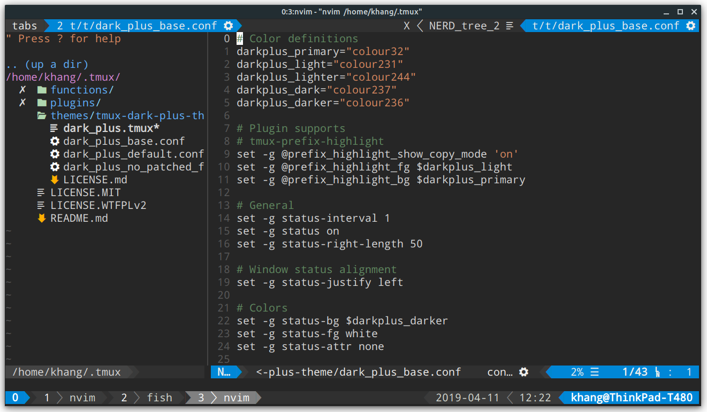
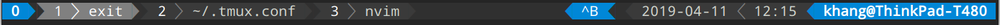

# Tmux Dark Plus Theme

Dark+ theme for Tmux, without powerline separators.

## Installation

### Install using [Tmux Plugin Manager](https://github.com/tmux-plugins/tpm)

1.  Add plugin to the list of TPM plugins in `.tmux.conf`:

        set -g @plugin 'AvivYaish/tmux-dark-plus-theme'

2.  Hit `prefix + I` to fetch the plugin and source it. The theme should now be working.
<!--

### Install manually

1.  Clone repo to local machine:

        git clone https://github.com/khang-hoang/tmux-dark-plus-theme ~/.tmux/themes/tmux-dark-plus-theme

2.  Add this line to the bottom of your `~/.tmux.conf`:

        run-shell "~/.tmux/themes/tmux-dark-plus-theme/dark_plus.tmux"

3.  Reload your `~/.tmux.conf`:

        tmux source-file ~/.tmux.conf

    -->

## Themes

## Plugin support

### [tmux-prefix-highlight](https://github.com/tmux-plugins/tmux-prefix-highlight)

Plugin that highlight the tmux _prefix_- key status.

## License

MIT
